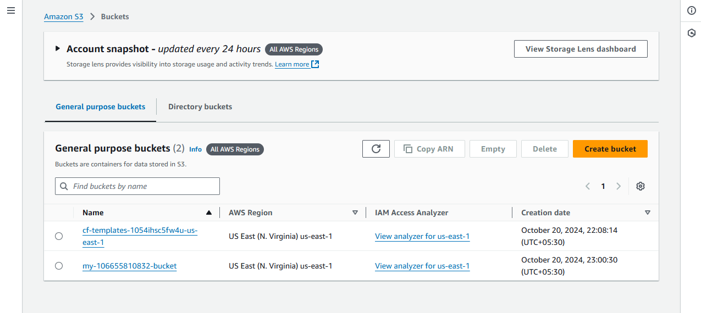
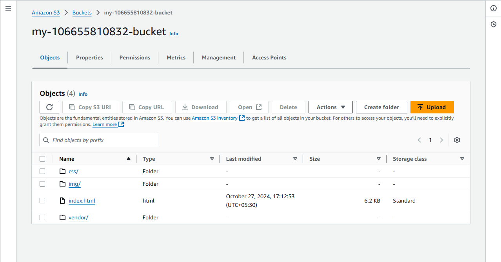
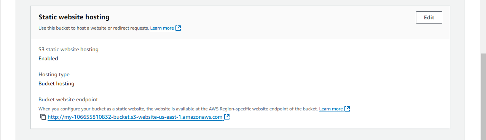
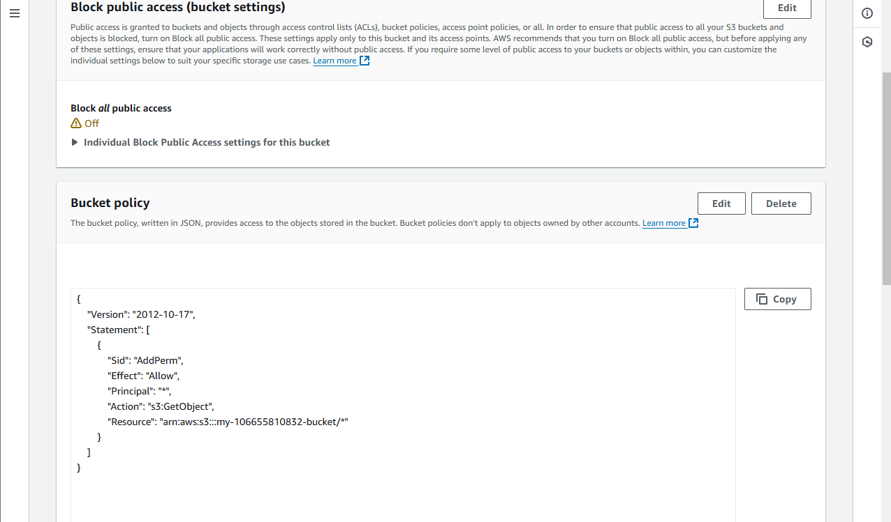
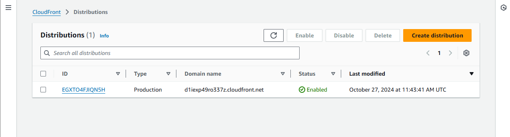

# Cloud DevOps Engineer – Project 1 
## Deploy Static Website on AWS 

### Website Endpoints 
Cloudfront Domain Name URL: d1iexp49ro337z.cloudfront.net 

Website endpoint URLs:  

[Cloudfront URL] https://d1iexp49ro337z.cloudfront.net/  
[S3 Static URL] http://my-106655810832-bucket.s3-website-us-east-1.amazonaws.com/  
[Direct File Link] http://my-106655810832-bucket.s3.amazonaws.com/index.html

## Exercise Details
### 1. Website Files 

Created a S3 Bucket: 

Website files were added to S3 bucket: 

Static Website Hosting Configuration: 

Static Link: http://my-106655810832-bucket.s3-website-us-east-1.amazonaws.com  

Permission – Public Access:  

### 2. Website Distribution 

Distribution via Cloudfront:: 

### 3. Web Browser Access 

Cloudfront Domain Name URL: d1iexp49ro337z.cloudfront.net 

Website endpoint URL:  

[Cloudfront URL] https://d1iexp49ro337z.cloudfront.net/  
[S3 Static URL] http://my-106655810832-bucket.s3-website-us-east-1.amazonaws.com/  
[Direct File Link] http://my-106655810832-bucket.s3.amazonaws.com/index.html

